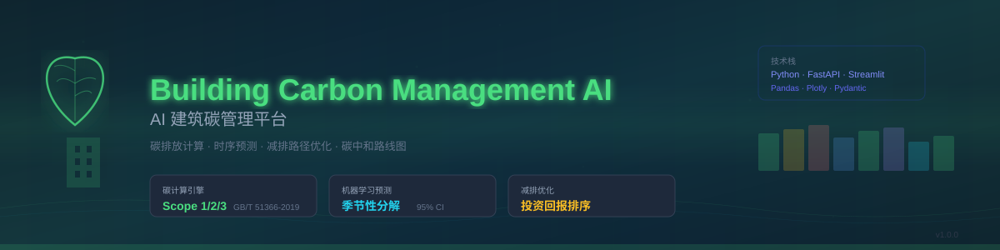

<!--
╔══════════════════════════════════════════════════════════════════════╗
║  DreamSeed 种梦计划 — AI创造者大赛 官方 README 模板                ║
║                                                                      ║
║  使用说明：                                                          ║
║  1. 将本模板放在参赛仓库根目录 README.md 的顶部                     ║
║  2. 头图使用 DreamField 官方公开活动图片地址                         ║
║  3. 请保留 DREAMFIELD_README_HEADER_START / END 标识                 ║
║  4. 分割线以下供创作者自由编写项目内容                               ║
╚══════════════════════════════════════════════════════════════════════╝
-->

<!-- DREAMFIELD_README_HEADER_START -->

<p align="center">
  <a href="https://www.dreamfield.top">
    
  </a>
</p>

<!-- DREAMFIELD_README_HEADER_END -->

---


<div align="center">
  
  <br>
  <br>

[](https://www.python.org/)
[](https://fastapi.tiangolo.com/)
[](https://streamlit.io/)
[](LICENSE)
[](https://github.com/psf/black)
[](https://github.com/c50346867/building-carbon-ai/pulls)

<h3>🌱 AI-Powered Building Carbon Management Platform</h3>
<h3>🌱 AI 建筑碳管理平台 — 碳排放计算 · 预测 · 减排���化</h3>

<p align="center">
  <b>English</b> | <a href="#中文">中文</a>
</p>

</div>

---

## English

### Overview

**Building Carbon Management AI** is an enterprise-grade, open-source platform for building carbon emission management. It aligns with China's "Dual Carbon" (碳达峰·碳中和) national strategy and Huawei Digital Energy's green & low-carbon narrative.

Built with Python and modern web frameworks, it provides:

- ✅ **Carbon Calculation** — Scope 1/2/3 emissions per GB/T 51366-2019
- 🔮 **Emission Forecasting** — Seasonal decomposition + trend-based prediction with 95% CI
- 🎯 **Reduction Optimization** — Smart decarbonization pathway recommendations ranked by ROI
- 📊 **Interactive Dashboard** — Real-time carbon metrics, charts, and reports
- 🌍 **China Regional Grid Factors** — Built-in emission factors for 7 Chinese regions

### Features

| Feature | Description |
|---------|-------------|
| **Carbon Calculator** | Scope 1 (direct), Scope 2 (purchased energy), Scope 3 (supply chain) emissions |
| **Emission Predictor** | Time-series forecasting using seasonal decomposition with confidence intervals |
| **Reduction Optimizer** | Multi-criteria optimization (cost, payback, implementation difficulty) with 10 built-in measures |
| **Building Simulator** | Realistic building emission data generator with climate/occupancy effects |
| **Interactive Dashboard** | Streamlit-powered: pie charts, trends, forecasts, optimization reports |
| **REST API** | FastAPI-based, fully documented endpoints for all core features |

### Quick Start

```bash
# Clone the repository
git clone https://github.com/c50346867/building-carbon-ai.git
cd building-carbon-ai

# Install dependencies
pip install -r requirements.txt

# Run the demo
python examples/demo.py

# Launch the dashboard
streamlit run frontend/app.py

# Start the API server
uvicorn backend.api.main:app --reload --port 8000
```

### API Endpoints

| Method | Endpoint | Description |
|--------|----------|-------------|
| GET | `/api/v1/health` | Health check |
| GET | `/api/v1/factors` | Get emission factors |
| POST | `/api/v1/calculate` | Calculate emissions from custom sources |
| POST | `/api/v1/quick-estimate` | Quick emission estimate |
| POST | `/api/v1/predictor/forecast` | Forecast future emissions |
| POST | `/api/v1/optimize` | Optimize reduction pathways |
| POST | `/api/v1/simulate` | Generate simulated building data |

### Project Structure

```
building-carbon-ai/
├── backend/
│   ├── api/main.py              # FastAPI REST API
│   └── core/
│       ├── carbon_calculator.py     # Emission calculator
│       ├── emission_predictor.py    # Time-series predictor
│       ├── reduction_optimizer.py   # Pathway optimizer
│       └── simulator.py             # Data simulator
├── frontend/
│   └── app.py                  # Streamlit dashboard
├── examples/
│   └── demo.py
├── data/
│   ├── emission_factors.json    # Emission factor DB
│   └── sample_building_data.csv
├── tests/
│   └── test_core.py
├── pyproject.toml
├── requirements.txt
└── LICENSE
```

### Emission Factors

The platform includes emission factors for:

- **Grid electricity** — 7 Chinese regional factors (Northeast, North, East, Central, South, Northwest, Southwest)
- **Fossil fuels** — Natural gas, diesel, gasoline, LPG, coal
- **Refrigerants** — R410A, R134A, R32 (GWP per IPCC AR6)
- **Water & wastewater** — Supply chain Scope 3 emissions
- **Building materials** — Cement, steel, aluminum, glass
- **Green sinks** — Tree carbon sequestration, green roof offsets

### Dashboard Preview

The Streamlit dashboard provides:

- **Carbon Overview** — Total emissions, intensity (kgCO₂/m²), YoY change
- **Scope Breakdown** — Scope 1/2/3 pie chart
- **Emission Trends** — Monthly/annual time series with stacked scope view
- **Energy Analysis** — Electricity, gas, diesel, water consumption breakdown
- **Temperature Correlation** — Emission vs ambient temperature overlay
- **Forecast** — 12-month forward prediction with 95% CI
- **Optimization** — Ranked reduction measures with ROI analysis
- **Roadmap** — Carbon neutrality timeline visualization

### Running Tests

```bash
python -m pytest tests/ -v
```

### License

[MIT License](LICENSE)

### Acknowledgments

- Built with ❤️ for the "种梦计划" (Dream Planting Initiative)
- References: GB/T 51366-2019, IPCC AR6 Guidelines
- Inspired by Huawei Digital Energy's green development vision

---

<a name="中文"></a>

## 中文

### 项目概览

**AI 建筑碳管理平台** 是一个企业级开源建筑碳排放管理平台，贴近中国"双碳"（碳达峰·碳中和）国家政策与华为数字能源绿色低碳叙事。

基于 Python 及现代 Web 框架构建，提供：

- ✅ **碳排放计算** — Scope 1/2/3 全范围计算，符合 GB/T 51366-2019 标准
- 🔮 **碳排放预测** — 季节性分�� + 趋势预测，含 95% 置信区间
- 🎯 **减排路径优化** — 智能推荐最优减排组合，按投资回报排序
- 📊 **交互式仪表盘** — 实时碳数据大屏、图表、报告
- 🌍 **中国区域电网因子** — 内置七大区域电网排放因子

### 功能清单

| 功能 | 描述 |
|------|------|
| **碳排放计算器** | 支持 Scope 1（直接排放）、Scope 2（电力/热力）、Scope 3（供应链） |
| **碳排放预测器** | 基于季节性分解的时序预测，含置信区间 |
| **减排路径优化器** | 多目标优化（成本、回收期、实施难度），内置 10 种典型措施 |
| **建筑模拟器** | 基于气候/入住率等参数生成逼真建筑排放数据 |
| **交互式仪表盘** | Streamlit 驱动：饼图、趋势图、预测、优化报告 |
| **REST API** | FastAPI 构建，所有核心功能均有完整 API |

### 快速开始

```bash
# 克隆仓库
git clone https://github.com/c50346867/building-carbon-ai.git
cd building-carbon-ai

# 安装依赖
pip install -r requirements.txt

# 运行示例
python examples/demo.py

# 启动仪表盘
streamlit run frontend/app.py

# 启动 API 服务
uvicorn backend.api.main:app --reload --port 8000
```

### API 接口

| 方法 | 接口 | 说明 |
|------|------|------|
| GET | `/api/v1/health` | 健康检查 |
| GET | `/api/v1/factors` | 获取排放因子 |
| POST | `/api/v1/calculate` | 自定义源碳排放计算 |
| POST | `/api/v1/quick-estimate` | 快速排放估算 |
| POST | `/api/v1/predictor/forecast` | 碳排放预测 |
| POST | `/api/v1/optimize` | 减排路径优化 |
| POST | `/api/v1/simulate` | 生成模拟建筑数据 |

### 项目结构

```
building-carbon-ai/
├── backend/
│   ├── api/main.py              # FastAPI REST API
│   └── core/
│       ├── carbon_calculator.py     # 碳排放计算器
│       ├── emission_predictor.py    # 时序预测器
│       ├── reduction_optimizer.py   # 路径优化器
│       └── simulator.py             # 数据模拟器
├── frontend/
│   └── app.py                  # Streamlit 仪表盘
├── examples/
│   └── demo.py
├── data/
│   ├── emission_factors.json    # 排放因子数据库
│   └── sample_building_data.csv
├── tests/
│   └── test_core.py
├── pyproject.toml
├── requirements.txt
└── LICENSE
```

### 排放因子

平台内置排放因子包括：

- **电网电力** — 七大区域排放因子（华北、东北、华东、华中、西北、南方、西南）
- **化石燃料** — 天然气、柴油、汽油、液化石油气、煤炭
- **制冷剂** — R410A、R134A、R32（IPCC AR6 GWP 值）
- **水资源** — 自来水及污水处理（Scope 3）
- **建筑材料** — 水泥、钢筋、电解铝、玻璃
- **碳汇** — 树木固碳量、屋顶绿化抵消

### 仪表盘功能

Streamlit 仪表盘提供：

- **碳排总览** — 总排放量、强度（kgCO₂/m²）、同比变化
- **Scope 占比** — Scope 1/2/3 饼图
- **排放趋势** — 月度/年度堆叠时序图
- **能源分析** — 电力、燃气、柴油、用水分解
- **温度关联** — 碳排放 vs 环境温度叠加图
- **排放预测** — 未来 12 个月预测（含 95% 置信区间）
- **优化推荐** — 按投资回报排序的减排措施清单
- **路线图** — 碳中和实施时间线可视化

### 运行测试

```bash
python -m pytest tests/ -v
```

### 许可证

[MIT 许可证](LICENSE)

### 致谢

- ❤️ 为"种梦计划"打造
- 参考标准：GB/T 51366-2019、IPCC AR6 指南
- 灵感来源于华为数字能源绿色发展愿景

---

<div align="center">
  <sub>Built with ❤️ for a greener future</sub>
</div>
